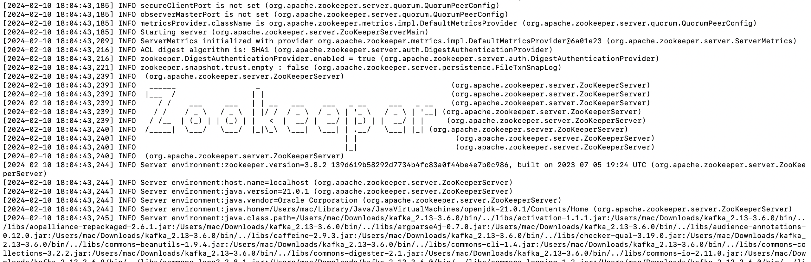
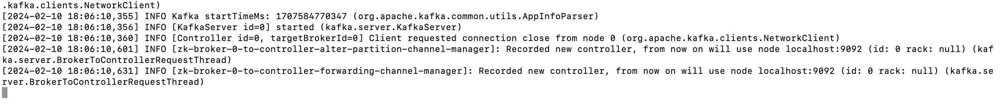
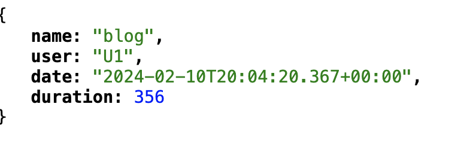
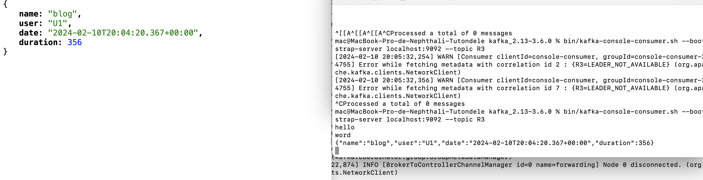
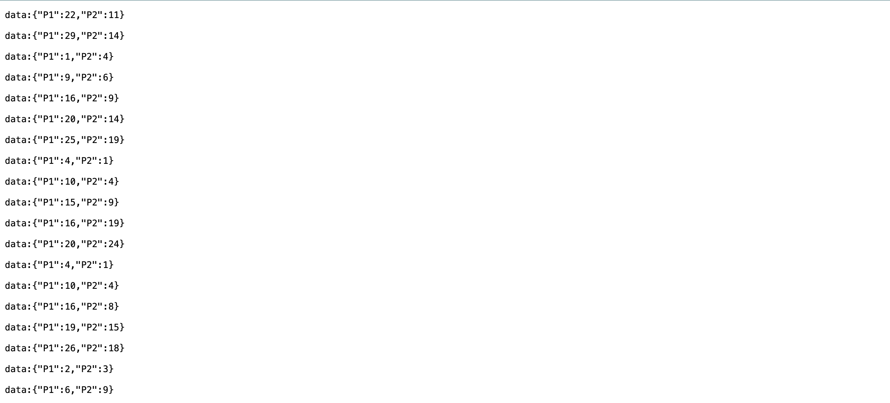
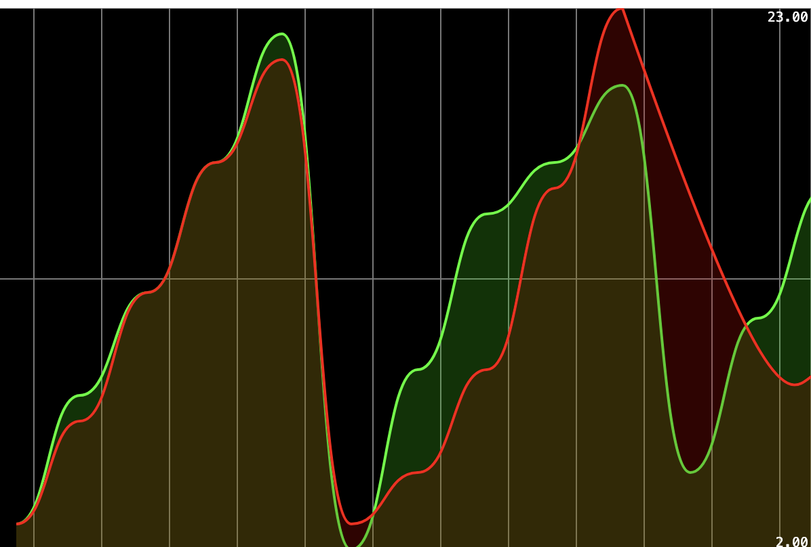
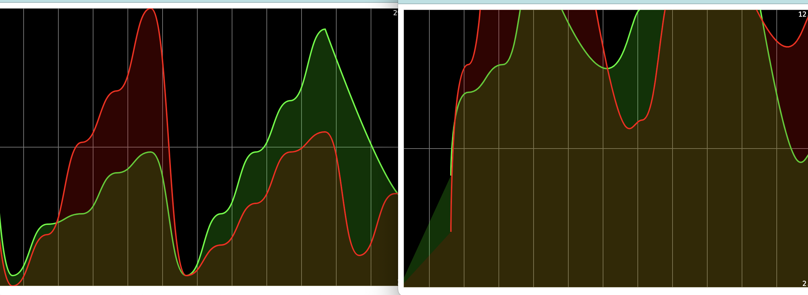

# Springcloud-streams-kafka-app

The Springcloud-streams-kafka-app is depicted through various images:

1. **Zookeeper:**
   
   Settings of Zookeeper.

2. **Kafka:**
   
   Details for Kafka, a distributed event streaming platform.

3. **Test Environment:**
   
   
   Further details and configuration aspects of the test environment.

6. **Stream Visualization 1:**
   
   Visualization of data streams within the application.

7. **Stream Visualization 2:**
   
   Additional visualization demonstrating the flow of data streams.

8. **Graphical Representation 1:**
   
   Graphical representation of data flow within the application.

9. **Graphical Representation 2:**
   
   Another graphical representation emphasizing data flow and relationships.

These images collectively provide an in-depth understanding of the Springcloud-streams-kafka-app, covering components such as Zookeeper, Kafka, test environments, stream console, and graphical representations.
